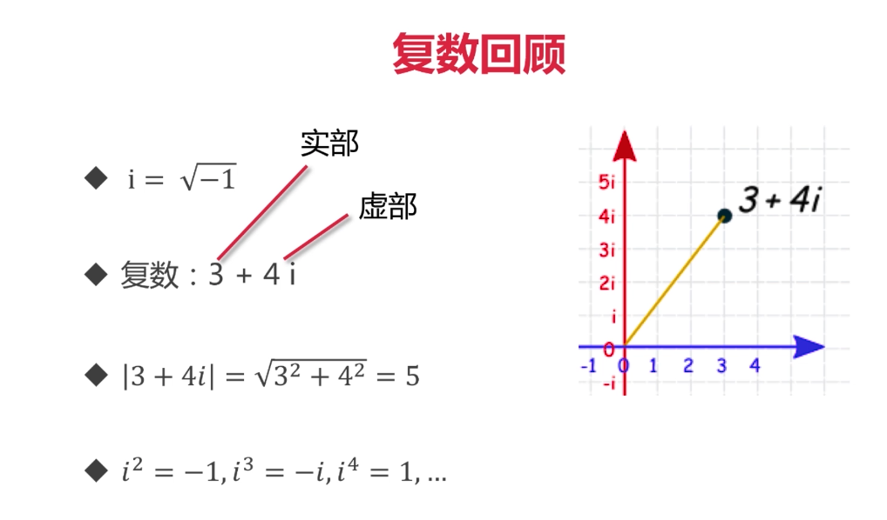
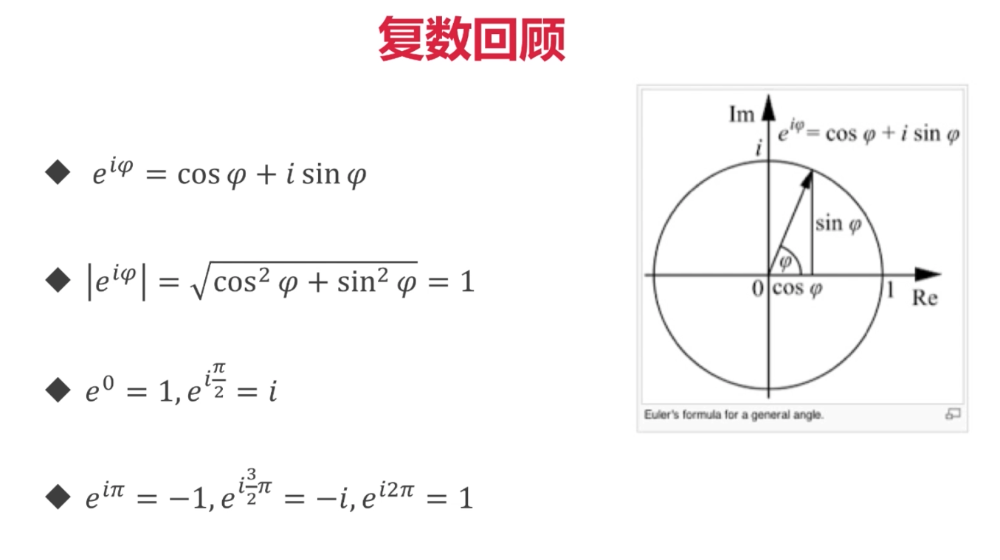
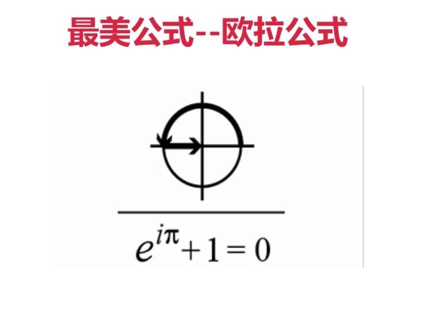
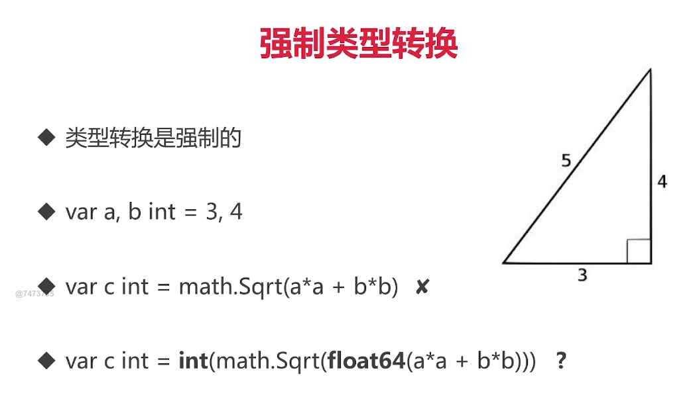

# 内建变量类型

* bool, string
* (u)int, (u)int8, (u)int16, (u)int32, (u)int64, uintptr
> 加u是无符号整数，不加u是有符号整数，有符号整数还分两类，规定长度的，不规定长度的，不规定长度的跟系统来(32/64)bit
* byte, rune
> byte是8位的，rune就是go的char，类型长度32位
* float32, float64, complex64, complex128

# 复数回顾

# 强制类型转换

